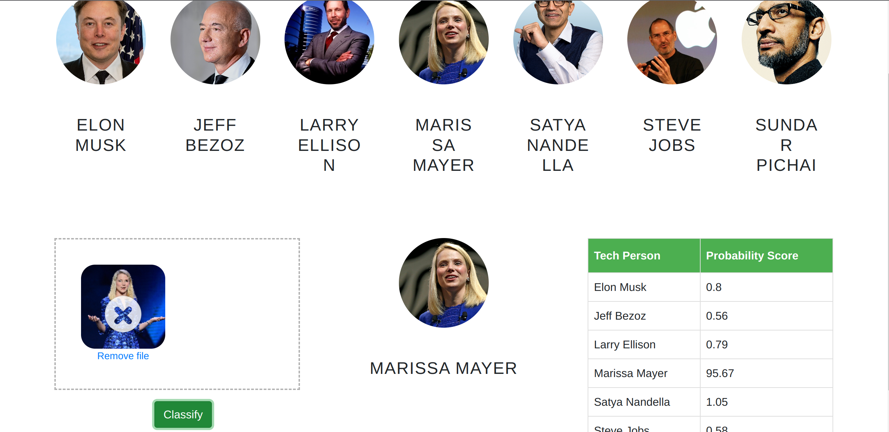

# Tech-image-classifier

### This is an end to end image classification project.  
#### In this data science and machine learning project, we classify Tech personalities. We restrict classification to only 7 people,
1. Elon Musk
2. Jeff Bezoz
3. Larry Ellison
4. Marissa Mayer
5. Satya Nandella
6. Steve Jobs
7. Sundar Pichai

It uses a pretrained model. The project involves web scraping to get the images from the internet.  
The user drags and drops and drops (selects) the image of one of the listed tech figures and the model is able to identify the person. 
If the model is not able to predict the face, it throws a face-mismatch message. 
### Technologies used in this project.
1. Python
2. Numpy and OpenCV for data cleaning
3. Matplotlib & Seaborn for data visualization
4. Sklearn for model building
5. Jupyter notebook, visual studio code and pycharm as IDE
6. Python flask for http server
7. HTML/CSS/Javascript for UI 

click the link for project demo.
https://tech-celeb-image-classifier-bec63196d31a.herokuapp.com/
